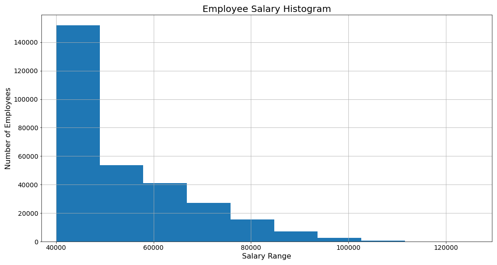
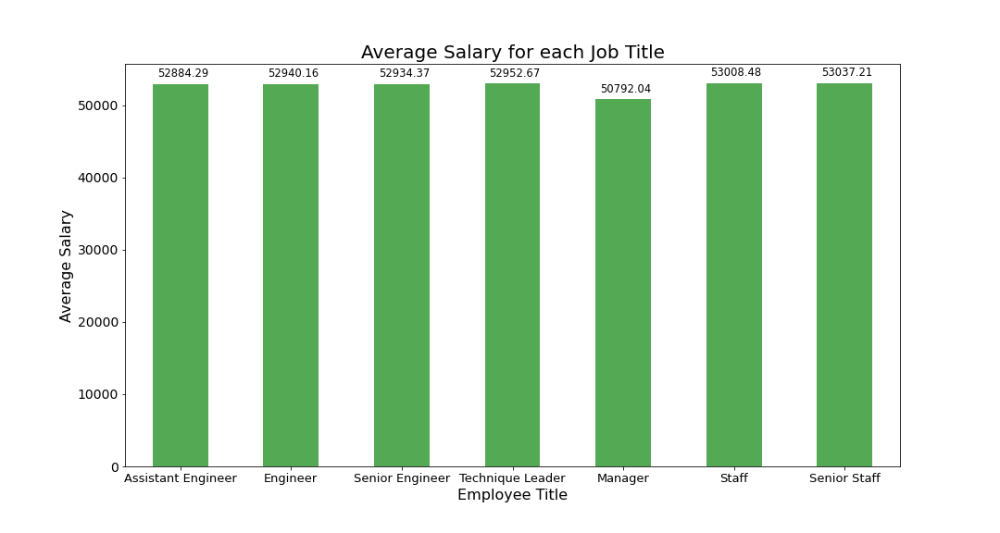

# SQL Homework - Employee Database: A Mystery in Two Parts
### David Fournie 
#### 1/16/2021

####
### Task One: List the following details of each employee: employee number, last name, first name, sex, and salary.
Since the information requested is located in two different tables, it seemed easiest to create a Veiw(employee_salaries) of the join between the Employees and Salaries tables. That way the pertinent information can be queried without having to write longer code.

####
### Task Two: List first name, last name, and hire date for employees who were hired in 1986.
This task was straigtforward. All that needed to be done was to query the Employees table for first name, last name, and hire date and filter it by hiring date year 1986. There are curently 36,150 employees working that were hired in 1986. A View(employees_1986) was created from this query for easy access in the future.

####
### Task Three: List the manager of each department with the following information: department number, department name, the manager's employee number, last name, first name.
For this task, it was easyist to split it up into multiple parts: 

In the first part, a View, manager_personal_info, was created which contained employee number, last name, and first name.

In the second part, a View,manager_departments_info, was created which contained employee number, dept name, and dept number.

In the third part, the two previous Views were joined and saved into the full_manager_info View for ease of future access.

####
### Task Four:List the department of each employee with the following information: employee number, last name, first name, and department name.
This was a repeat of Task Three expect manger were replaced with non-manager employees and department number was removed.

####
### Task Five:List first name, last name, and sex for employees whose first name is "Hercules" and last names begin with "B."
This task was similar to Task Two. first name, last name, and sex was queried from the Employees table Where first name = 'Hercules' AND last name began with 'B'. A View was created from this query(hercules_info) for ease of information access in the future. Fun Fact: There are 20 employees that fit these parameters.

####
### Task Six: List all employees in the Sales department, including their employee number, last name, first name, and department name.
Task Six, like Tasks Three and Four, was divided into more than one part:

In part one, a View was created(sales_dept_info) which was the employee_departments_info View with the dept_name filtered to 'Sales'.

In part two, sales_dept_info was joined to Employees. A View(employee_sales_dept_info) was created of the join to provide ease of access in the future.

####
### Task Seven: List all employees in the Sales and Development departments, including their employee number, last name, first name, and department name.
This task is a repeat of Task six only instead of 'Sales' being the only filter on dept name, 'Development' is added to the filter conditions. The Views created for this task were : sales_development_dept_info, and employee_sales_development_dept_info.

####
### Task Eight: In descending order, list the frequency count of employee last names, i.e., how many employees share each last name.
This task was also straightforward. By quering last_name and the count of last name(last_name_total) from employees, Grouping the data by last name, and ordering the data by descending values from last_name_total the most common frequencies of last names were accessible. This query was saved into the last_name_count View.

####
### Additional Information
A histogram of employee salaries and a bar chart of avg salary for each title have been included:

It is odd that the average salaries per title are so close at around $50,000. However looking at the histogram, almost two_thirds of employees make $50,000 or under which would skew the average salary for each title.

####
### Follow Ups
The ipynb file was named fake_data due to the suspicion that some or all of the data may be faked.

There should be an investigation on employee with employee number 499942. He seems to be playing a practical joke on HR...